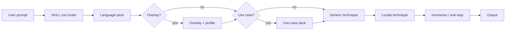
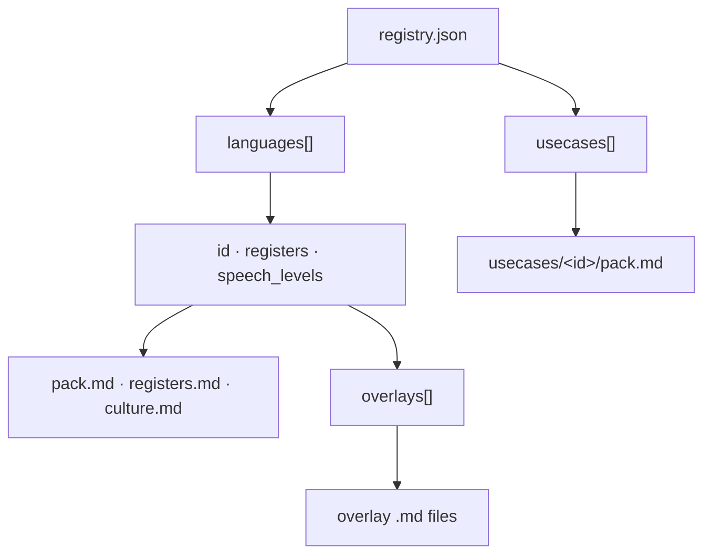

# Polyglot Copywriter

**Multilingual copywriter with dialect overlays: humanize, rewrite, and draft natural copy in 97 real languages.**

Registry-driven routing loads only the language pack, regional overlay, and use-case structure you need. Simple prose and anti-slop by default. Optional personal fingerprint for English and Bahasa Indonesia only.

## Install

Install from the [skills.sh directory](https://skills.sh) (or any compatible agent-skills CLI):

```bash
npx skills add pahlevikun/polyglot-copywriter
```

## What it does

- **Registry routing**: `references/registry.json` indexes 97 real languages and 18 use cases; `SKILL.md` stays a thin router
- **Dialect overlays**: 163 regional, slang, and city mixes (Kansai vs Tokyo, Seoul vs Busan, vi-north/south, Jaksel, es-bo/pe/cl, Singlish, and more)
- **Use cases**: email, chat, marketing, incident reports, docs, academic, and other structure packs (format only; language rules stay in language packs)
- **Simple prose**: common words, short sentences, one idea per line, in every language
- **Anti-slop**: strips AI clusters, symbol spam, and vague corporate phrasing
- **Honesty boundaries**: umbrella and limited-coverage packs say what they support; no invented forms outside the active pack
- **Fictional catalog**: `atlantis`, `klingon`, `elvish`, `navi` live in `fictional-catalog.json` for eval/honesty only, separate from real languages
- **Optional Farhan fingerprint**: `mas`/`kak`, end-to-end ownership tone for **English** and **Indonesia** when requested; other languages use a careful coworker voice

## Before / after

Same bug context: a checkout timeout that hit ~3% of sessions for about 20 minutes.

### English (casual coworker)

| Before (generic AI) | After (polyglot-copywriter) |
|---|---|
| We have identified an issue affecting the checkout flow. The team is actively investigating and will provide updates as they become available. | Checkout timed out for about 3% of sessions for ~20 min. I traced it to a stale cache on the payment gateway. Rolled back at 14:32 UTC; error rate is back to normal. I'll post a short postmortem tomorrow. |

### Indonesian: santai vs baku

| Before (generic AI) | After santai | After baku |
|---|---|---|
| Terdapat gangguan pada proses checkout. Tim kami sedang melakukan investigasi menyeluruh dan akan memberikan pembaruan segera. | Checkout sempat timeout buat sekitar 3% session selama ~20 menit. Gue udah trace ke cache payment gateway yang stale, rollback jam 14:32 UTC, error rate balik normal. Besok gue share postmortem singkat. | Checkout mengalami timeout pada sekitar 3% sesi selama ±20 menit. Saya menelusuri penyebabnya ke cache gateway pembayaran yang kedaluwarsa; rollback dilakukan pukul 14:32 UTC dan tingkat error kembali normal. Postmortem singkat akan saya bagikan besok. |

### Japanese: Tokyo standard vs Kansai overlay

| Before (generic AI) | After Tokyo (standard) | After Kansai overlay |
|---|---|---|
| チェックアウト処理に問題が発生しており、現在調査中です。追ってご連絡いたします。 | チェックアウトが約20分、セッションの3%くらいでタイムアウトしました。決済ゲートウェイの古いキャッシュが原因で、14:32 UTCにロールバック済みです。エラー率は戻ってます。明日短いポストモーテム出します。 | チェックアウトがだいたい20分、セッションの3%くらいでタイムアウトしとったわ。決済ゲートウェイの古いキャッシュが原因で、14:32 UTCにロールバックした。エラー率は戻っとる。明日ちょいポストモーテム出すわ。 |

## Coverage

Counts from [`references/registry.json`](references/registry.json) (schema v2) and [`references/fictional-catalog.json`](references/fictional-catalog.json) (schema v1), verified by `python3 scripts/validate_skill.py`:

| Axis | Count | Notes |
|---|---:|---|
| Languages | 97 | Registry only (real langs): each has `pack.md`, `registers.md`, `culture.md` |
| Registers per language | 3 | `baku`, `profesional`, `santai` (default `santai`) |
| Overlays | 163 | `regional`, `slang`, `mix`. See [`dialect-coverage.md`](references/dialect-coverage.md) |
| Speech-level languages | 5 | Jawa, Sunda, Bali, Japanese, Korean |
| Umbrella languages | 3 | `arabic`, `dayak`, `kurdish`. Ask for variety before thick prose |
| Fictional fixtures | 4 | `atlantis`, `klingon`, `elvish`, `navi`. Eval/honesty only; not in registry |
| Use cases | 18 | Structure only, not language rules |

## How it works

Instead of one giant prompt, the skill is a **thin router** (`SKILL.md`) that loads only the packs needed for the current request.

1. **User request → router**: Resolve language, register, overlay, and use case from the user's text or config axes ([`configuration.md`](references/configuration.md)).
2. **Language pack**: `registry.json` points at `references/languages/<id>/` with `pack.md`, `registers.md`, and `culture.md`.
3. **Optional overlay**: When `regional_voice` is set (or the user names a dialect), load the matching overlay under `overlays/` and, if helpful, a snapshot from [`references/profiles/`](references/profiles/).
4. **Optional use case**: Email, marketing, incident, chat, and similar ids load `references/usecases/<id>/pack.md` for **structure only**.
5. **Technique modules**: Generic techniques (`marketing-copy`, `email-comms`, `incident-comms`, …) first; then a locale file from [`techniques/locales/<lang>.md`](references/techniques/locales/) when one exists.
6. **Voice pipeline**: Core rules ([`core.md`](references/core.md)), simple prose ([`simple-prose.md`](references/simple-prose.md)), anti-slop ([`anti-slop-prose.md`](references/anti-slop-prose.md)), optional Farhan fingerprint ([`voice-fingerprint.md`](references/voice-fingerprint.md), EN/ID only), then evaluation ([`evaluation.md`](references/evaluation.md)).
7. **Output**: Natural prose in the target language, register, and dialect, with protected artifacts (numbers, names, links) preserved.

### Routing flow



### Registry plug-in model

`registry.json` is the single index. Each `languages[]` row links to pack files and an `overlays[]` list; each `usecases[]` row links to a structure pack. Add a language or use case by registering a row and filling the referenced markdown. `SKILL.md` stays thin.



## Usage

Invoke when you want natural, register-appropriate copy:

- "Write this outage update in casual Indonesian."
- "Rewrite in Kansai Japanese, professional register."
- "Landing page copy in Spanish (Argentina overlay), marketing use case."

### Key concepts

| Concept | What it does | Examples |
|---|---|---|
| **Language** | Chooses the output language and base pack | `english`, `indonesia`, `japanese`, `vietnamese` |
| **Register** | Formality level (three per language) | `baku` (standard), `profesional`, `santai` (default) |
| **Overlay** | Regional dialect, slang, or city mix on top of the base language | Kansai/Tokyo, Seoul/Busan, vi-north/south, Jaksel, Singlish |
| **Use case** | Document structure only, not language rules | `email`, `chat`, `marketing`, `incident`, `academic` |

Lookup a language id: `python3 scripts/find_language.py <name>`.

Configuration axes (`register`, `regional_voice`, `speech_level`, `intensity`) are documented in [`references/configuration.md`](references/configuration.md).

## Why this skill

Most copywriting and humanize skills ship a single prompt with no language packs, no dialect overlays, and no tests. **Polyglot Copywriter** adds:

- **Validated registry**: every language row must pass schema checks and link integrity before merge
- **Eval cases**: `evals/cases.json` enforces invariants (artifact preservation, overlay honesty, umbrella boundaries)
- **Honesty boundaries**: umbrella and limited-coverage packs say what they support; the skill does not invent forms outside the active pack

## Honesty policy

Load the active pack and write naturally. If the language is umbrella, limited-coverage, or **not in the registry**, state the boundary briefly and do not invent forms the pack does not support.

**Fictional languages** (`atlantis`, `klingon`, `elvish`, `navi`) exist for **eval and honesty testing** only. They are listed in [`fictional-catalog.json`](references/fictional-catalog.json), not `registry.json`. The agent must state the limit in one sentence and fall back to Indonesian or English. Never invent vocabulary or roleplay the fiction.

| Fixture | Source |
|---|---|
| `atlantis` | Fictional lost-city trope |
| `klingon` | Star Trek (`tlhIngan Hol`) |
| `elvish` | Tolkien (Quenya / Sindarin) |
| `navi` | Avatar (James Cameron) |

## Contributing

See [CONTRIBUTING.md](CONTRIBUTING.md) for how to add a language, use case, locale technique, or overlay profile; PR expectations; and the English-only rule for agent instructions.

Quick start:

1. **Add a language**: `python3 scripts/new_language.py <id> "<Name>"`, fill packs, register in `references/registry.json`.
2. **Add a use case**: `python3 scripts/new_usecase.py <id> "<Name>"`, fill `references/usecases/<id>/pack.md`, register.
3. **Add a locale technique**: `references/techniques/locales/<id>.md` + row in `references/techniques/index.json`.
4. **Add a profile**: `references/profiles/<id>.md` + row in `references/profiles/index.json`.

Pull requests must pass validation and unit tests (see below). Overlay conventions: [`references/dialect-coverage.md`](references/dialect-coverage.md).

## Validation

From the skill root (clone or after `npx skills add`):

```bash
python3 scripts/validate_skill.py
python3 -m unittest discover -s tests -q
python3 scripts/evaluate_output.py <case-id> <output-file>
```

`validate_skill.py` checks links, registry integrity, required eval cases, and that every language has `pack.md` + `registers.md` + `culture.md`. `evals/cases.json` holds invariant prompts (artifact preserve, overlay mix forbidden, umbrella clarify, limited-pack honesty).

## File tree

```
polyglot-copywriter/
├── README.md
├── CONTRIBUTING.md
├── SKILL.md
├── LICENSE
├── references/
│   ├── registry.json
│   ├── fictional-catalog.json
│   ├── schema/
│   ├── core.md, configuration.md, evaluation.md, regional.md, dialect-coverage.md
│   ├── techniques/
│   ├── profiles/
│   ├── _template/
│   ├── languages/<id>/
│   └── usecases/<id>/pack.md
├── scripts/
│   ├── validate_skill.py
│   ├── find_language.py
│   ├── new_language.py, new_usecase.py
│   └── evaluate_output.py
├── evals/cases.json
└── tests/
```

## License

MIT. Copyright (c) 2026 Farhan Pahlevi. See [LICENSE](LICENSE).
