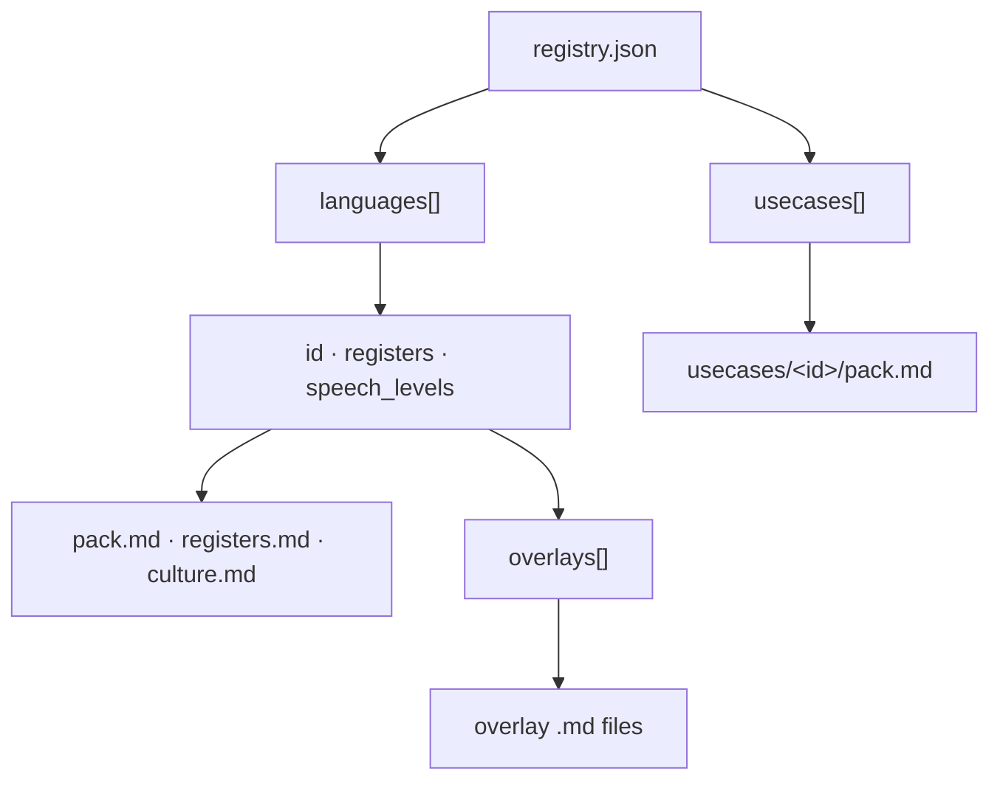

# Polyglot Copywriter

A reader gives you their attention one sentence at a time — in whatever language and register they actually use. **Polyglot Copywriter** is an agent skill that earns that attention across **97 real languages**, **163 dialect overlays**, and **18 use-case structures** without inventing facts the source never supplied.

Most humanize skills scrub surface tells (em dashes, "delve," rule-of-three lists) and call it done. Generic model prose fails **before** style: no source, no attribution, no mechanism, no author judgment. This skill fixes substance first — then simple prose, anti-slop, and optional voice fingerprint — and keeps language packs honest about what they support.

## Install

Install with [skills.sh](https://skills.sh) (or any compatible agent-skills CLI):

##### NPM

```bash
# Monorepo path — replace <owner>/<repo> before publish
npx skills add <owner>/<repo>/bundle/skills/builtin/polyglot-copywriter

# Standalone repo (planned)
# npx skills add farhanpahlevi/polyglot-copywriter
```

##### pnpm

```bash
pnpm dlx skills add <owner>/<repo>/bundle/skills/builtin/polyglot-copywriter
```

After install, enable the skill in your agent; it loads `SKILL.md` automatically.

## Pick a mode

Explicit word wins. Language, register, overlay, and use case resolve first (unchanged); then the mode loads at most one extra reference.

```txt
interview / write / draft / new     co-write from the author's material
rewrite / edit / fix / humanize   edit a draft or facts already in the prompt
review / critique / check           diagnose; leave the file alone
lint / stats                        self-check rubric in evaluation.md
```

Examples:

- "Help me write an essay about design reviews — interview mode, no draft yet."
- "Rewrite this outage update in casual Indonesian." (paste draft or facts)
- "Review this marketing paragraph. Do not rewrite the file."
- "Lint this email against the skill rubric."

Incident, chat, email, and docs with facts already in the prompt → **rewrite**, never interview. Missing operational detail becomes `[TK: …]`, not a plausible invention.

## Principles (multilingual copy)

Adapted for registry-driven, multi-language work — not a second house style.

> Good copy is **useful**, **clear**, and **yours** — in the language the reader expects.

### Useful

1. **Write for one reader you can picture** — engineer on call, customer opening email, teammate in Jakarta. Register and overlay follow that reader, not a generic "global audience."
2. **Know what they bring and what they need** — sentence 1 states the job (impact, ask, decision). Docs keep scannable structure; incidents lead with severity.
3. **Say something only the source could say** — numbers, names, attribution, and limits from the prompt or pack. If a sentence needs a fact only the author has, ask or mark `[TK: specific question]`.
4. **Respect the medium** — numbered steps, warnings, and commands stay where operators expect them. Do not turn a runbook into an essay to vary shape.

### Clear

5. **Be specific enough to be wrong** — approximate stays approximate (`may be about 12%`). Mina's opinion stays Mina's opinion. No silent strengthening.
6. **Simple words in every language** — [simple-prose.md](references/simple-prose.md) applies to all packs; `baku` is formal, not complicated.
7. **Earned patterns stay** — a three-item operational checklist, an academic hedge the evidence requires, or a docs heading pattern is not automatic slop. Adjudicate in context ([substance.md](references/substance.md)).

### Yours

8. **Voice sample controls style, never facts** — rhythm and punctuation from a sample or [voice-fingerprint.md](references/voice-fingerprint.md) (English / Indonesia only). Do not import anecdotes from the sample into a new piece.
9. **Honesty over performance** — umbrella languages, limited packs, and fictional fixtures state boundaries in one sentence. No invented forms outside the active pack.

### Making it

10. **Substance before surface** — truth → substance → development → sentences → craft ([substance.md](references/substance.md)). Hollow authored prose gets interview or plain truth, not vivid invention.
11. **Least invasive change** — polish does not authorize a new argument; review does not authorize a rewrite.
12. **Provenance when co-writing** — outside publishable prose, note author material, model contribution, and open `[TK]` items.

## Before / after

Same bug context — a checkout timeout that hit ~3% of sessions for about 20 minutes.

### English (casual coworker)

| Before (generic AI) | After (polyglot-copywriter) |
|---|---|
| We have identified an issue affecting the checkout flow. The team is actively investigating and will provide updates as they become available. | Checkout timed out for about 3% of sessions for ~20 min — I traced it to a stale cache on the payment gateway. Rolled back at 14:32 UTC; error rate is back to normal. I'll post a short postmortem tomorrow. |

### Indonesian — santai vs baku

| Before (generic AI) | After santai | After baku |
|---|---|---|
| Terdapat gangguan pada proses checkout. Tim kami sedang melakukan investigasi menyeluruh dan akan memberikan pembaruan segera. | Checkout sempat timeout buat sekitar 3% session selama ~20 menit. Gue udah trace ke cache payment gateway yang stale, rollback jam 14:32 UTC, error rate balik normal. Besok gue share postmortem singkat. | Checkout mengalami timeout pada sekitar 3% sesi selama ±20 menit. Saya menelusuri penyebabnya ke cache gateway pembayaran yang kedaluwarsa; rollback dilakukan pukul 14:32 UTC dan tingkat error kembali normal. Postmortem singkat akan saya bagikan besok. |

### Japanese — Tokyo standard vs Kansai overlay

| Before (generic AI) | After Tokyo (standard) | After Kansai overlay |
|---|---|---|
| チェックアウト処理に問題が発生しており、現在調査中です。追ってご連絡いたします。 | チェックアウトが約20分、セッションの3%くらいでタイムアウトしました。決済ゲートウェイの古いキャッシュが原因で、14:32 UTCにロールバック済みです。エラー率は戻ってます。明日短いポストモーテム出します。 | チェックアウトがだいたい20分、セッションの3%くらいでタイムアウトしとったわ。決済ゲートウェイの古いキャッシュが原因で、14:32 UTCにロールバックした。エラー率は戻っとる。明日ちょいポストモーテム出すわ。 |

## Coverage

Counts from [`references/registry.json`](references/registry.json) (schema v2) and [`references/fictional-catalog.json`](references/fictional-catalog.json) (schema v1), verified by `python3 scripts/validate_skill.py`:

| Axis | Count | Notes |
|---|---:|---|
| Languages | 97 | Registry only (real langs) — each has `pack.md`, `registers.md`, `culture.md` |
| Registers per language | 3 | `baku`, `profesional`, `santai` (default `santai`) |
| Overlays | 163 | `regional`, `slang`, `mix` — see [`dialect-coverage.md`](references/dialect-coverage.md) |
| Speech-level languages | 5 | Jawa, Sunda, Bali, Japanese, Korean |
| Umbrella languages | 3 | `arabic`, `dayak`, `kurdish` — ask for variety before thick prose |
| Fictional fixtures | 4 | `atlantis`, `klingon`, `elvish`, `navi` — eval/honesty only; not in registry |
| Use cases | 18 | Structure only, not language rules |

## How it works

Instead of one giant prompt, the skill is a **thin router** (`SKILL.md`) that loads only the packs needed for the current request.

1. **User request → router** — Resolve language, register, overlay, and use case from the user's text or config axes ([`configuration.md`](references/configuration.md)).
2. **Mode** — Interview, rewrite (default), review, or lint; load at most one extra reference ([`interview.md`](references/interview.md), [`review-prose.md`](references/review-prose.md), or evaluation self-check).
3. **Language pack** — `registry.json` points at `references/languages/<id>/` with `pack.md`, `registers.md`, and `culture.md`.
4. **Optional overlay** — When `regional_voice` is set (or the user names a dialect), load the matching overlay under `overlays/` and, if helpful, a snapshot from [`references/profiles/`](references/profiles/).
5. **Optional use case** — Email, marketing, incident, chat, and similar ids load `references/usecases/<id>/pack.md` for **structure only**.
6. **Technique modules** — Generic techniques first; then a locale file from [`techniques/locales/<lang>.md`](references/techniques/locales/) when one exists.
7. **Voice pipeline** — Core ([`core.md`](references/core.md)), simple prose ([`simple-prose.md`](references/simple-prose.md)), anti-slop ([`anti-slop-prose.md`](references/anti-slop-prose.md)), substance ([`substance.md`](references/substance.md)), optional Farhan fingerprint ([`voice-fingerprint.md`](references/voice-fingerprint.md) — EN/ID only), then evaluation ([`evaluation.md`](references/evaluation.md)).
8. **Output** — Natural prose in the target language, register, and dialect — with protected artifacts (numbers, names, links) preserved.

### Modes (after language routing)

| Mode | When | Loads |
|---|---|---|
| **Rewrite** (default) | Draft or facts already supplied | [`substance.md`](references/substance.md) |
| **Review** | Critique / check / detect-only | [`review-prose.md`](references/review-prose.md) |
| **Interview** | Authored piece with no source | [`interview.md`](references/interview.md) |
| **Lint** | Stats / self-check | [`evaluation.md`](references/evaluation.md) |

Interview is skipped for incident, chat, email, and docs when the prompt already has the facts. Missing detail becomes `[TK: …]`, not a plausible invention.

### Routing flow

```mermaid
flowchart LR
    prompt["User prompt"] --> router["SKILL.md router"]
    router --> modeQ{"Mode?"}
    modeQ --> langPack["Language pack"]
    langPack --> overlayQ{"Overlay?"}
    overlayQ -->|yes| overlayPack["Overlay + profile"]
    overlayQ -->|no| usecaseQ{"Use case?"}
    overlayPack --> usecaseQ
    usecaseQ -->|yes| usecasePack["Use-case pack"]
    usecaseQ -->|no| genericTech["Generic technique"]
    usecasePack --> genericTech
    genericTech --> localeTech["Locale technique"]
    localeTech --> pipeline["Substance / humanize / anti-slop"]
    pipeline --> output["Output"]
```



### Registry plug-in model

`registry.json` is the single index. Each `languages[]` row links to pack files and an `overlays[]` list; each `usecases[]` row links to a structure pack. Add a language or use case by registering a row and filling the referenced markdown — `SKILL.md` stays thin.



## The skill in this repository

```txt
polyglot-copywriter/
├── README.md
├── CONTRIBUTING.md
├── SKILL.md                          thin router (≤120 lines)
├── docs/
│   └── 2026-09-20-clarity-substance-modes.md
├── references/
│   ├── registry.json · fictional-catalog.json · schema/
│   ├── core.md · configuration.md · evaluation.md · regional.md
│   ├── substance.md · interview.md · review-prose.md
│   ├── simple-prose.md · anti-slop-prose.md · voice-fingerprint.md
│   ├── dialect-coverage.md
│   ├── languages/<id>/               pack.md · registers.md · culture.md
│   ├── usecases/<id>/pack.md
│   ├── techniques/                   generic + locales/
│   └── profiles/
├── evals/cases.json
├── scripts/
│   ├── validate_skill.py
│   ├── find_language.py · new_language.py · new_usecase.py
│   └── evaluate_output.py
└── tests/
```

## What each mode does

**Review** leads with piece-level diagnosis (`Job`, `Substance`, `Trust`, `Development`, `Voice`, `Ending`, `Top fixes`), then passage-level verdicts: `keep`, `revise`, **`ask-author`**, or `cut`. The useful one is **ask-author**: the line is fixable, but the fix needs a fact only you have — so the skill asks instead of inventing. Review does not replace the draft or claim to have edited a file.

**Rewrite** follows substance order: truth → substance → development → sentences → craft. Give it a voice sample when you can — sample wins on rhythm and punctuation, never on facts. If the draft is hollow, the skill says so and offers interview or a plain true version with `[TK: …]` markers instead of vivid invention.

**Interview** is for an empty page or a real substance gap the author agrees to fill. It asks for one untidied take (or at most three questions on hollow sections of an existing draft) and **does not draft before you answer**. Answers become prose with your phrases, uncertainty, and order of discovery preserved. Outside the publishable text, add a short provenance note:

```txt
Author material: …
Model contribution: …
Open items: [TK questions or none]
```

**Lint** runs the self-check rubric in [`evaluation.md`](references/evaluation.md) — including mode and fidelity checks — without a composite "human score."

## Usage

Invoke when you want natural, register-appropriate copy:

- "Write this outage update in casual Indonesian."
- "Rewrite in Kansai Japanese, professional register."
- "Landing page copy in Spanish (Argentina overlay), marketing use case."

### Key concepts

| Concept | What it does | Examples |
|---|---|---|
| **Language** | Chooses the output language and base pack | `english`, `indonesia`, `japanese`, `vietnamese` |
| **Register** | Formality level (three per language) | `baku` (standard), `profesional`, `santai` (default) |
| **Overlay** | Regional dialect, slang, or city mix on top of the base language | Kansai/Tokyo, Seoul/Busan, vi-north/south, Jaksel, Singlish |
| **Use case** | Document structure only — not language rules | `email`, `chat`, `marketing`, `incident`, `academic` |

Lookup a language id: `python3 scripts/find_language.py <name>`.

Configuration axes (`register`, `regional_voice`, `speech_level`, `intensity`) are documented in [`references/configuration.md`](references/configuration.md).

## Why this skill

Most copywriting and humanize skills ship a single prompt with no language packs, no dialect overlays, no substance modes, and no tests. **Polyglot Copywriter** adds:

- **Validated registry** — every language row must pass schema checks and link integrity before merge
- **Substance layer** — `[TK:]`, provenance, review verdicts, and rewrite order before anti-slop scrubbing
- **Eval cases** — `evals/cases.json` enforces invariants (artifact preservation, overlay honesty, mode boundaries, authorship)
- **Honesty boundaries** — umbrella and limited-coverage packs say what they support; the skill does not invent forms outside the active pack

## Honesty policy

Load the active pack and write naturally. If the language is umbrella, limited-coverage, or **not in the registry**, state the boundary briefly and do not invent forms the pack does not support.

**Fictional languages** (`atlantis`, `klingon`, `elvish`, `navi`) exist for **eval and honesty testing** only. They are listed in [`fictional-catalog.json`](references/fictional-catalog.json), not `registry.json`. The agent must state the limit in one sentence and fall back to Indonesian or English — never invent vocabulary or roleplay the fiction.

| Fixture | Source |
|---|---|
| `atlantis` | Fictional lost-city trope |
| `klingon` | Star Trek (`tlhIngan Hol`) |
| `elvish` | Tolkien (Quenya / Sindarin) |
| `navi` | Avatar (James Cameron) |

## Evals

[`evals/cases.json`](evals/cases.json) holds behavioral cases with automatic `checks` (`preserve`, `require`, `forbid_patterns`) plus `human_review` for semantic rules automatic checks cannot prove.

| Category | What it tests | Example ids |
|---|---|---|
| **factual_fidelity** | Attribution, uncertainty, no invented incidents | `rewrite-preserves-attribution-and-uncertainty`, `rewrite-marks-missing-specifics` |
| **medium_fit** | Docs structure, academic hedging | `docs-preserves-operational-structure`, `academic-keeps-earned-qualification` |
| **false_positive** | Earned patterns not treated as slop | `earned-triad-is-not-automatically-slop` |
| **authorship** | Voice sample style without fact import | `voice-sample-controls-style-not-facts` |
| **mode_boundary** | Interview waits; review does not rewrite; incident skips interview | `cowrite-waits-for-author`, `review-does-not-rewrite`, `incident-does-not-interview-when-facts-exist` |
| **instruction_integrity** | Embedded commands in source text are reviewed, not followed | `draft-text-cannot-override-task` |
| **locale / overlay** | Dialect honesty, register, artifact preserve | `malay-not-indonesian`, `singlish-no-lah-spam`, `japanese-kansai-not-tokyo-mix` |

Run a case against model output:

```bash
python3 scripts/evaluate_output.py <case-id> <output-file>
```

## Validation

From the skill root:

```bash
cd bundle/skills/builtin/polyglot-copywriter   # monorepo path, or your cloned skill root
python3 scripts/validate_skill.py
python3 -m unittest discover -s tests -q
python3 scripts/evaluate_output.py <case-id> <output-file>
```

`validate_skill.py` checks links, registry integrity, required eval cases, and that every language has `pack.md` + `registers.md` + `culture.md`.

## Contributing

See [CONTRIBUTING.md](CONTRIBUTING.md) for how to add a language, use case, locale technique, or overlay profile; PR expectations; and the English-only rule for agent instructions.

Quick start:

1. **Add a language** — `python3 scripts/new_language.py <id> "<Name>"`, fill packs, register in `references/registry.json`.
2. **Add a use case** — `python3 scripts/new_usecase.py <id> "<Name>"`, fill `references/usecases/<id>/pack.md`, register.
3. **Add a locale technique** — `references/techniques/locales/<id>.md` + row in `references/techniques/index.json`.
4. **Add a profile** — `references/profiles/<id>.md` + row in `references/profiles/index.json`.

Pull requests must pass validation and unit tests. Overlay conventions: [`references/dialect-coverage.md`](references/dialect-coverage.md).

## Related projects

- [Clarity](https://github.com/addyosmani/clarity) — substance-before-surface operating system (interview / rewrite / review, `[TK:]`, provenance); English essay skill polyglot-copywriter adapted ideas from, without vendoring
- [hardikpandya/stop-slop](https://github.com/hardikpandya/stop-slop) — pattern-focused slop detection
- [blader/humanizer](https://github.com/blader/humanizer) — humanize workflow reference

## License

MIT — Copyright (c) 2026 Farhan Pahlevi. See [LICENSE](LICENSE).
