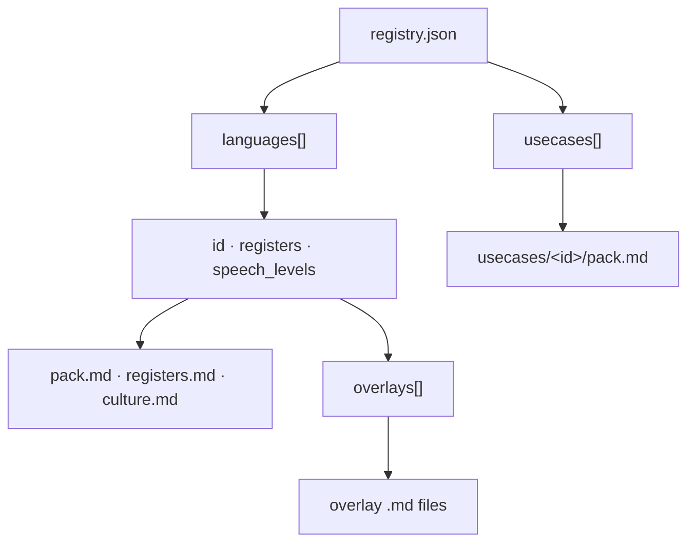

# Polyglot Copywriter

A reader gives you their attention one sentence at a time — in whatever language and register they actually use. **Polyglot Copywriter** is an agent skill that earns that attention across **97 real languages**, **163 dialect overlays**, and **18 use-case structures** without inventing facts the source never supplied.

Most humanize skills scrub surface tells (em dashes, "delve," rule-of-three lists) and call it done. Generic model prose fails **before** style: no source, no attribution, no mechanism, no author judgment. This skill fixes substance first — then simple prose, anti-slop, and optional voice fingerprint — and keeps language packs honest about what they support.

## Install

Install with [skills.sh](https://skills.sh) (or any compatible agent-skills CLI):

##### NPM

```bash
# Monorepo path — replace <owner>/<repo> with your TeamHarness fork
npx skills add <owner>/<repo>/bundle/skills/builtin/polyglot-copywriter

# Standalone repo
npx skills add farhanpahlevi/polyglot-copywriter
```

##### pnpm

```bash
pnpm dlx skills add <owner>/<repo>/bundle/skills/builtin/polyglot-copywriter
# or
pnpm dlx skills add farhanpahlevi/polyglot-copywriter
```

After install, enable the skill in your agent; it loads `SKILL.md` automatically.

## Pick a mode

Explicit word wins. Language, register, overlay, and use case resolve first; then the mode loads at most one extra reference.

```txt
interview / write / draft / new     co-write from the author's material
rewrite / edit / fix / humanize   edit a draft or facts already in the prompt
review / critique / check           diagnose; leave the file alone
lint / stats                        self-check rubric in evaluation.md
```

Examples:

- "Help me write an essay about design reviews — interview mode, no draft yet."
- "Rewrite this outage update in casual Indonesian." (paste draft or facts)
- "Review this marketing paragraph. Do not rewrite the file."
- "Lint this email against the skill rubric."

Incident, chat, email, and docs with facts already in the prompt → **rewrite**, never interview. Missing operational detail becomes `[TK: …]`, not a plausible invention.

[Full walkthrough below.](#three-ways-to-use-it)

## On copy that earns its reader

A reader gives you their attention one sentence at a time. They take it back the moment a sentence stops paying — whether that sentence is in English, Indonesian, Japanese, or any of the ninety-seven languages this skill registers.

Structure, grammar, word choice, register, and rhythm all serve that bargain. In `baku` Indonesian the bargain is formal but not ornate. In `santai` chat it may be one line and a number. In a Kansai overlay the bargain includes dialect markers the Tokyo standard would not use — and the skill must not mix them without saying so.

Most advice about writing is advice about how to stop wasting attention. Cut the adverb. Use the short word. Name the actor. All of it is right, and all of it starts one step too late. The fastest way to waste a reader's attention is to write something correct in the right language that they did not need — or to write something vivid in the wrong register, with facts the source never supplied.

So the first work is not on the page. It is deciding who you are writing for, in which language and overlay, what they already carry, and what they should be holding when they finish.

> Good copy is **useful**, **clear**, and **yours** — in the language the reader expects.

What follows is what holds across multilingual copy, adapted from essay-writing craft and a substance-before-surface operating system (interview, rewrite, review, `[TK: …]` gaps, provenance). The usual advice needs adjusting when the reader is an engineer on call, a customer opening email, or a teammate in Jakarta who expects `santai` prose, not a global-audience essay.

---

## Useful

### 1. Write for one reader you can picture

A piece written by you, to a specific audience: a specific person, at a specific point in their day, in a specific role — and in the language and register they actually use. It might be the engineer who's been on call for six hours and needs the rollback time in the first line. It might be a customer opening a shipping-delay email who needs the new date, not a paragraph about your commitment to excellence. It might be you, back when you thought formal `baku` prose was the only respectable way to write in Indonesian.

This is not hypothetical: you are, right now, writing. So consider that you are making decisions. What's the best way to explain this outage? Should this chat message be `profesional` or `santai`? Does this reader expect Jaksel mix, Kansai dialect, or Tokyo standard? All these decisions become softer when you write to everyone in every register at once. You know that you'll please someone at one end of the bell curve while frustrating someone at the other who needed something subtler — or more direct.

The registry does not choose the reader for you. It gives you ninety-seven language packs, three registers each (`baku`, `profesional`, `santai`), and one hundred sixty-three overlays. Your job is to pick the row that matches the person in front of you, not the row that sounds most impressive.

> Your whole duty as a writer is to please and satisfy yourself, and the true writer always plays to an audience of one.
>
> — Strunk & White, *The Elements of Style*

### 2. Know what they bring, and what they need from you

Underlying both decisions and clarity is this: the reader has something in their head as they sit down to read. Some of it's correct, some of it's stale and needs replacing, and some of it's a misconception you're writing to correct.

Throughout a single piece you'll face two different questions: What context does the reader already have? and, crucially, What context does the reader need? The gap between those two answers defines the piece. This is the main point where writers of incident updates, product emails, and internal docs fail in their first draft: they go straight from the fact they want to report to the tone they want to perform, completely bypassing what the reader actually needs in the first sentence.

An incident reader needs impact, scope, current status, and what to do next — in the register your team actually uses in chat. A docs reader needs scannable headings and commands where operators expect them. An email reader needs the ask in the subject or the first line. The skill's use-case packs (`incident`, `email`, `chat`, `docs`, and fourteen others) supply **structure only**; they do not replace your judgment about what this reader needs right now.

### 3. Decide what they take away

Your piece must center around a single thing. That thing should be stated in a sentence, ideally somewhere close to the beginning. (No, even now, you feel an internal twitch that says "I should warm up with context before the number," but for an outage update, stick the number up front.) It should be stated in a way that someone could reasonably argue with — when the medium allows argument. A chat message may only need "rollback done, monitoring"; an essay needs a claim.

That is to say, the difference is between subject and claim. A subject lets you talk about the subject as fully as you can, but risks slowly drifting away from your topic. A claim invites you to argue; it demands that you persuade. Not every medium owes a thesis. Reference pages, runbooks, and status lines may be neutral. Do not demand a personal essay from an incident template.

> Every successful piece of nonfiction should leave the reader with one provocative thought that he or she didn't have before. Not two thoughts, or five, just one.
>
> — William Zinsser, *On Writing Well*

### 4. Say something only the source could say

Doesn't this apply to everyone? A check you can do on each paragraph is: could this paragraph (nearly) word for word appear in someone else's article on the same subject — in any language? If something passes this test, then it's filler, even if it's well made and even if the grammar is perfect `baku` Indonesian.

What tends to survive the test is your stuff: specific observed details, measured numbers, incidents of which you were a party, lived arguments, changed beliefs. In a rewrite, that stuff must come from the prompt, the draft, or the author's interview answers — not from the model's habit of plausible color. `~3% of sessions for about 20 minutes` survives. `a significant number of users were affected` does not.

This is the stuff that can't be borrowed. If your piece isn't full of it, then it's sourceless. It's why writing exists at all. A draft that lacks it has a sourcing problem, not a prose problem — and no amount of anti-slop scrubbing in Japanese or Spanish will fix that.

### 5. Make every sentence pay

Now, try this: each sentence should leave the reader with more than the prior one. Don't repeat the same point in different words. Don't throat-clear in any language — "Terdapat gangguan pada proses checkout" and "We have identified an issue affecting the checkout flow" are the same empty payment in different packs.

Most padding is caused not by not having enough to say, but by choosing to make a piece longer than is needed to make your point. The other source is writing that follows someone else's form expectations: an introduction that introduces nothing, a conclusion that concludes nothing, or an incident update that performs empathy before stating scope.

So cut both causes of padding and move that short piece in front of your reader. A short status line that lands beats a long paragraph that covers. Protected artifacts — numbers, names, links, commands — stay where the medium needs them; everything else must earn its place.

---

## Clear

### 6. Be specific enough to be wrong

Vague writing can't be verified, so it can't be trusted — in English, Indonesian, Japanese, or any pack in the registry.

Try to be as specific as you can. Take a sentence like "our internal test suggests startup may be about 12% faster on Pixel 8." It has numbers and attribution. Now take "performance improved significantly after the cache change." It has the grammar of a specific and the content of an abstraction. The obvious course of action is to keep the 12%, keep Pixel 8, keep the sample size of 40, and keep "Mina thinks the cache change caused most of the gain" as Mina's opinion — not narrator fact. When a writer fails to do so, they have written the abstraction with more words in a fancier register.

> Prefer the specific to the general, the definite to the vague, the concrete to the abstract.
>
> — Strunk & White, *The Elements of Style*

If you can't think of a verifiable example, then delete it rather than blurring it. If you can't think of a sensible example, then don't invent one — mark `[TK: specific question]` or use `ask-author` in review. When you fabricate a detail, you destroy any residual trust, and that failure travels across languages faster than good grammar.

### 7. Put someone in the sentence

Give people agency. Decisions, cultures, and data don't act; people do.

Sentences like "bad things tend to happen in March" have no human actor. Find a more concrete subject. Try: "Most people find March a difficult month for things to go according to plan." Now you can see who is doing the action. In incident copy: "I traced it to a stale cache on the payment gateway" beats "an issue was identified in the payment subsystem."

Use the second-person "you" when no specific person fits and the medium allows it. In some languages and registers (`baku` formal, certain overlays), direct "you" may be wrong — the active pack and overlay say when. The principle holds: someone should be doing something, not "a situation was encountered."

### 8. Use plain words in every language

Prefer shorter words and sentences rather than longer ones. Short words and single-idea sentences read more easily than long words and sentences that express more than one idea. [`simple-prose.md`](references/simple-prose.md) applies to all packs: `baku` is formal, not complicated. Formal Japanese is not ornate Japanese. Formal Indonesian is not English calques stacked into every line.

A simple style is the result of thorough thinking. Ornate prose in any language often indicates that the writer still doesn't have a clear picture of what they are trying to say — or that the model is performing fluency without substance.

> Simple writing is persuasive. A good argument in five sentences will sway more people than a brilliant argument in a hundred sentences.
>
> — Scott Adams

### 9. Cut what does no work, then stop

When editing, flag every passage that you suspect might be superfluous. Then consider whether the piece still works without it. If it does, remove it.

Over-stripping qualifiers yields inhuman prose. True writing contains a certain amount of hedging to reflect the writer's own uncertainty — and academic or observational copy may **require** earned qualification. Strip qualifiers that hide a claim. Keep those that honestly represent genuine uncertainty. A three-item operational checklist is not automatic slop; an academic hedge the evidence requires is not weakness. Adjudicate in context ([`substance.md`](references/substance.md), [`anti-slop-prose.md`](references/anti-slop-prose.md)).

Do not turn a runbook into an essay to vary shape. Do not casualize a warning block because it "looks like AI." Cut ceremony, not structure the medium needs.

### 10. Say the relation instead of implying it

Putting two sentences next to each other can create a sense of logical connection between them based only on rhythm. "The benchmark is saturated. The model still fails in production." Is the second sentence the cause of the first, or the consequence? The rhythm implies an answer, and while you are reading it feels like reasoning.

Try to supply the word: *because*, *although*, *once*, *where*, *so that* — or the equivalent connector in the target language. If you cannot supply it without inventing the relation, then the relation was never there.

*Although the benchmark is saturated, the model still fails in production, which means the benchmark has stopped measuring what ships.* Adding an explicit connector turns a mere juxtaposition into a real claim. The same discipline applies when mixing languages in a `mix` overlay: the relation between clauses must be clear, not just the vibe.

---

## Yours

### 11. Take a position, and say where it is weak

Presenting both sides without taking a position isn't balanced. It feels empty, and readers know you are evading — in marketing copy, in essays, in internal memos.

State your leaning and say what makes you uneasy. Give the strongest real objection its own paragraph near the end. Answer or concede it. Conceding costs you nothing and gains you respect. When the medium is incident or ops mail, "position" may mean "here is what we know, here is what we don't, here is what we're doing next" — still a stance, still honest about gaps.

The objection has to be one that someone actually holds. Fabricating a weak opponent is as dishonest as inventing a statistic, and readers detect it quickly in any language.

### 12. Write the way you would say it — in the target register

Read a sentence aloud. If you would not say it to a colleague over lunch — in that register, in that dialect — you should not publish it.

This is why contractions, sentence-initial "but," and the first person are appropriate when the pack allows them: writing is a transaction between two people, and hiding one of those people discards half the power. [`voice-fingerprint.md`](references/voice-fingerprint.md) (English and Indonesia only) and an author-supplied voice sample control rhythm and punctuation; they never import facts or anecdotes from the sample into a new piece.

> Never say anything in writing that you wouldn't comfortably say in conversation.
>
> — William Zinsser, *On Writing Well*

### 13. Do not perform — and do not fake the pack

Avoid fake erudition, fake humility, or a voice that sounds rough or as if it were studied. Avoid performing dialect: spamming `lah` in Singlish, mixing Kansai and Tokyo markers, or inventing forms the active overlay does not support.

Umbrella languages (`arabic`, `dayak`, `kurdish`), limited-coverage packs, and fictional fixtures (`atlantis`, `klingon`, `elvish`, `navi` — eval and honesty only, not in the registry) require a one-sentence boundary statement. The skill loads the active pack and writes naturally within it. It does not roleplay fiction or invent vocabulary outside the pack. Honesty over performance.

---

## Making it

### 14. Give the first sentence its one job

Make the reader want to hear the second sentence of the piece — or, in chat and incident copy, make the second sentence unnecessary because the first already answered the job.

Effective openings are often a startling fact, a scene-setting description, a number, a provocative claim, or a leading question. A definition of the topic or an explanation of your intent will not work for an essay; for an incident, the opening fact **is** the intent. "Checkout timed out for about 3% of sessions for ~20 min" is the whole job for many readers.

### 15. Make each paragraph earn the next

Each paragraph should answer the question the previous one raised or raise the question the next one will answer.

Test your progress by covering the page and seeing if you can predict what will follow. If your headings are doing all the work of organizing your ideas, your writing is merely a list of items that might be arranged in a table of contents. Docs and runbooks are allowed to be lists — when lists are the medium. Essays and marketing long-form are not.

### 16. Stop where the thought stops

When the point is made, stop.

Bad endings usually result from the writer's summarizing a litany of traps, pitfalls, and opportunities or from offering the quotable line. A good ending often returns to a concrete item or circumstance from the story, states what will carry over, and stops. You may feel that it is abrupt and unfinished, but that is better than vague optimism — or, in corporate copy, better than "we remain committed to delivering excellence."

Chat and email often end after the ask. Incident updates end after status and next step. Long-form earns a real ending; messages earn a full stop.

### 17. Rewrite by cutting and reordering — substance first

Rewriting always means that you have moved the third paragraph to the top, deleted the proudest section of the first version, and found the true sentence buried inside the one you wrote.

Smoothing is not rewriting. Smoothing turns a rough authentic sentence into a bland one and polishes away the only interesting thing in your draft. This skill follows substance order: truth → substance → development → sentences → craft ([`substance.md`](references/substance.md)). Anti-slop and simple-prose come after the piece has something to say. If the draft is hollow, the skill says so and offers interview or a plain true version with `[TK: …]` markers instead of vivid invention.

> Rewriting is the essence of writing well: it's where the game is won or lost.
>
> — William Zinsser, *On Writing Well*

Least invasive change: polish does not authorize a new argument; review does not authorize a rewrite.

### 18. Read it aloud

Reread every time before sending.

Your ear catches what a checklist misses: plodding paragraphs, breathless clauses, repetitive sentence shapes; where reading stumbles, the sentence is wrong. Read in the target language and register — not in your drafting language. If the Kansai overlay is active, the rhythm should sound like Kansai, not like Tokyo with a few particles swapped in.

---

## The skill in this repository

The skill asks substance questions before stylistic edits, treats the author's supplied language as source material, routes ninety-seven language packs and one hundred sixty-three overlays through a thin registry, adjudicates patterns in context instead of applying blanket bans, and refuses to invent specifics — in any mode, in any pack.

```txt
polyglot-copywriter/
├── README.md
├── CONTRIBUTING.md
├── SKILL.md                          thin router (≤120 lines)
├── commands/                         optional slash wrappers (see below)
│   ├── polyglot-interview.md         /polyglot-interview
│   ├── polyglot-rewrite.md           /polyglot-rewrite
│   ├── polyglot-review.md            /polyglot-review
│   └── polyglot-lint.md              /polyglot-lint
├── docs/
│   ├── 2026-09-20-clarity-substance-modes.md
│   └── 2026-09-20-commands-audit.md
├── references/
│   ├── registry.json · fictional-catalog.json · schema/
│   ├── core.md · configuration.md · evaluation.md · regional.md
│   ├── substance.md · interview.md · review-prose.md
│   ├── simple-prose.md · anti-slop-prose.md · voice-fingerprint.md
│   ├── dialect-coverage.md
│   ├── languages/<id>/               pack.md · registers.md · culture.md
│   ├── usecases/<id>/pack.md
│   ├── techniques/                   generic + locales/
│   └── profiles/
├── evals/cases.json
├── scripts/
│   ├── validate_skill.py
│   ├── find_language.py · new_language.py · new_usecase.py
│   └── evaluate_output.py
└── tests/
```

### Three ways to use it

Once the skill is installed, name the mode in plain language. Language, register, overlay, and use case resolve from your request or config; nothing else to set up.

```txt
Help me write an essay about design reviews — interview mode, no draft yet.
Rewrite this outage update in casual Indonesian. [paste draft or facts]
Review this marketing paragraph. Do not rewrite the file.
Lint this email against the skill rubric.
```

`interview` co-writes from nothing, `rewrite` edits a draft or facts you already supplied, `review` gives you a critique and leaves your file alone, and `lint` runs the self-check in [`evaluation.md`](references/evaluation.md). Drop the mode word and the skill infers from what you gave it — except incident, chat, email, and docs with facts in the prompt always route to rewrite, never interview.

If you prefer dedicated slash commands, copy the wrappers in `commands/`:

```bash
cp commands/*.md ~/.claude/commands/
```

That gives `/polyglot-interview`, `/polyglot-rewrite`, `/polyglot-review`, and
`/polyglot-lint` (filenames match slash names).

| Slash command | Mode | Extra reference |
|---|---|---|
| `/polyglot-interview` | co-write | [`interview.md`](references/interview.md) |
| `/polyglot-rewrite` | rewrite (incl. `humanize`) | [`substance.md`](references/substance.md) |
| `/polyglot-review` | review | [`review-prose.md`](references/review-prose.md) |
| `/polyglot-lint` | lint / stats | [`evaluation.md`](references/evaluation.md) self-check |

Lookup a language id: `python3 scripts/find_language.py <name>`. Configuration axes (`register`, `regional_voice`, `speech_level`, `intensity`) are in [`configuration.md`](references/configuration.md).

### What each mode does

**Review** leads with piece-level diagnosis (`Job`, `Substance`, `Trust`, `Development`, `Voice`, `Ending`, `Top fixes`), then passage-level verdicts: `keep`, `revise`, **`ask-author`**, or `cut`. The useful one is **ask-author**: the line is fixable, but the fix needs a fact only you have — so the skill asks instead of inventing. Review does not replace the draft or claim to have edited a file. Loads [`review-prose.md`](references/review-prose.md).

**Rewrite** follows substance order: truth → substance → development → sentences → craft. Give it a voice sample when you can — sample wins on rhythm and punctuation, never on facts. If the draft is hollow, the skill says so and offers interview or a plain true version with `[TK: …]` markers instead of vivid invention. Loads [`substance.md`](references/substance.md) in the pipeline.

**Interview** is for an empty page or a real substance gap the author agrees to fill. It asks for one untidied take (or at most three questions on hollow sections of an existing draft) and **does not draft before you answer**. Questions run roughly:

```txt
What happened this week that made you want to write this? The trigger, not the topic.
Who are you arguing with, and what are they getting wrong?
Picture one reader. What do they already know, and what should change for them on Monday?
Say the argument out loud, the way you'd say it to a colleague at lunch.
Two or three real examples from your own work, with the real numbers and names.
What would you concede under questioning?
What do you believe here that most people in your field don't?
```

Then it builds the piece around what you said — in the resolved language and register. It protects distinctive phrases, mixed feelings, and the order in which you discovered the idea. Anywhere it needs a detail only you have, it leaves a marked gap instead of inventing one:

```txt
[TK: how many reviews had you run before you noticed? Rough number is fine.]
```

If a draft already exists but says nothing, rewrite will explain the substance gap and offer a shorter interview aimed at the hollow paragraphs. Loads [`interview.md`](references/interview.md).

**Lint** runs the self-check rubric in [`evaluation.md`](references/evaluation.md) — including mode and fidelity checks — without a composite "human score."

Outside the publishable prose, co-write and sourced rewrites add a short provenance note:

```txt
Author material: …
Model contribution: …
Open items: [TK questions or none]
```

### What that actually buys you

The interview gives the draft a source a model cannot supply on its own: your examples, language, uncertainty, and editorial judgment. It does not guarantee a detector result, and a detector result would not prove authorship or quality. This skill does not optimize for AI detectors.

[`evals/cases.json`](evals/cases.json) holds behavioral cases with automatic `checks` (`preserve`, `require`, `forbid_patterns`) plus `human_review` for semantic rules automatic checks cannot prove — factual fidelity, medium fit, false positives (earned triads and hedges), authorship (voice sample without fact import), mode boundaries (interview waits, review does not rewrite, incident skips interview when facts exist), instruction integrity, and locale/overlay honesty.

| Category | What it tests | Example ids |
|---|---|---|
| **factual_fidelity** | Attribution, uncertainty, no invented incidents | `rewrite-preserves-attribution-and-uncertainty`, `rewrite-marks-missing-specifics` |
| **medium_fit** | Docs structure, academic hedging | `docs-preserves-operational-structure`, `academic-keeps-earned-qualification` |
| **false_positive** | Earned patterns not treated as slop | `earned-triad-is-not-automatically-slop` |
| **authorship** | Voice sample style without fact import | `voice-sample-controls-style-not-facts` |
| **mode_boundary** | Interview waits; review does not rewrite; incident skips interview | `cowrite-waits-for-author`, `review-does-not-rewrite`, `incident-does-not-interview-when-facts-exist` |
| **instruction_integrity** | Embedded commands in source text are reviewed, not followed | `draft-text-cannot-override-task` |
| **locale / overlay** | Dialect honesty, register, artifact preserve | `malay-not-indonesian`, `singlish-no-lah-spam`, `japanese-kansai-not-tokyo-mix` |

Every language row must pass schema checks and link integrity before merge (`validate_skill.py`). Umbrella and limited-coverage packs say what they support; the skill does not invent forms outside the active pack.

### Validation

From the skill root:

```bash
cd bundle/skills/builtin/polyglot-copywriter   # monorepo path, or your cloned skill root
python3 scripts/validate_skill.py
python3 -m unittest discover -s tests -q
python3 scripts/evaluate_output.py <case-id> <output-file>
```

`validate_skill.py` checks links, registry integrity, required eval cases, and that every language has `pack.md` + `registers.md` + `culture.md`. `evaluate_output.py` runs automatic checks for a single eval case against model output.

## Before / after

Same bug context — a checkout timeout that hit ~3% of sessions for about 20 minutes.

### English (casual coworker)

| Before (generic AI) | After (polyglot-copywriter) |
|---|---|
| We have identified an issue affecting the checkout flow. The team is actively investigating and will provide updates as they become available. | Checkout timed out for about 3% of sessions for ~20 min — I traced it to a stale cache on the payment gateway. Rolled back at 14:32 UTC; error rate is back to normal. I'll post a short postmortem tomorrow. |

### Indonesian — santai vs baku

| Before (generic AI) | After santai | After baku |
|---|---|---|
| Terdapat gangguan pada proses checkout. Tim kami sedang melakukan investigasi menyeluruh dan akan memberikan pembaruan segera. | Checkout sempat timeout buat sekitar 3% session selama ~20 menit. Gue udah trace ke cache payment gateway yang stale, rollback jam 14:32 UTC, error rate balik normal. Besok gue share postmortem singkat. | Checkout mengalami timeout pada sekitar 3% sesi selama ±20 menit. Saya menelusuri penyebabnya ke cache gateway pembayaran yang kedaluwarsa; rollback dilakukan pukul 14:32 UTC dan tingkat error kembali normal. Postmortem singkat akan saya bagikan besok. |

### Japanese — Tokyo standard vs Kansai overlay

| Before (generic AI) | After Tokyo (standard) | After Kansai overlay |
|---|---|---|
| チェックアウト処理に問題が発生しており、現在調査中です。追ってご連絡いたします。 | チェックアウトが約20分、セッションの3%くらいでタイムアウトしました。決済ゲートウェイの古いキャッシュが原因で、14:32 UTCにロールバック済みです。エラー率は戻ってます。明日短いポストモーテム出します。 | チェックアウトがだいたい20分、セッションの3%くらいでタイムアウトしとったわ。決済ゲートウェイの古いキャッシュが原因で、14:32 UTCにロールバックした。エラー率は戻っとる。明日ちょいポストモーテム出すわ。 |

## Coverage

Counts from [`references/registry.json`](references/registry.json) (schema v2) and [`references/fictional-catalog.json`](references/fictional-catalog.json) (schema v1), verified by `python3 scripts/validate_skill.py`:

| Axis | Count | Notes |
|---|---:|---|
| Languages | 97 | Registry only (real langs) — each has `pack.md`, `registers.md`, `culture.md` |
| Registers per language | 3 | `baku`, `profesional`, `santai` (default `santai`) |
| Overlays | 163 | `regional`, `slang`, `mix` — see [`dialect-coverage.md`](references/dialect-coverage.md) |
| Speech-level languages | 5 | Jawa, Sunda, Bali, Japanese, Korean |
| Umbrella languages | 3 | `arabic`, `dayak`, `kurdish` — ask for variety before thick prose |
| Fictional fixtures | 4 | `atlantis`, `klingon`, `elvish`, `navi` — eval/honesty only; not in registry |
| Use cases | 18 | Structure only, not language rules |

## How it works

Instead of one giant prompt, the skill is a **thin router** (`SKILL.md`) that loads only the packs needed for the current request.

1. **User request → router** — Resolve language, register, overlay, and use case from the user's text or config axes ([`configuration.md`](references/configuration.md)).
2. **Mode** — Interview, rewrite (default), review, or lint; load at most one extra reference ([`interview.md`](references/interview.md), [`review-prose.md`](references/review-prose.md), or evaluation self-check).
3. **Language pack** — `registry.json` points at `references/languages/<id>/` with `pack.md`, `registers.md`, and `culture.md`.
4. **Optional overlay** — When `regional_voice` is set (or the user names a dialect), load the matching overlay under `overlays/` and, if helpful, a snapshot from [`references/profiles/`](references/profiles/).
5. **Optional use case** — Email, marketing, incident, chat, and similar ids load `references/usecases/<id>/pack.md` for **structure only**.
6. **Technique modules** — Generic techniques first; then a locale file from [`techniques/locales/<lang>.md`](references/techniques/locales/) when one exists.
7. **Voice pipeline** — Core ([`core.md`](references/core.md)), simple prose ([`simple-prose.md`](references/simple-prose.md)), anti-slop ([`anti-slop-prose.md`](references/anti-slop-prose.md)), substance ([`substance.md`](references/substance.md)), optional Farhan fingerprint ([`voice-fingerprint.md`](references/voice-fingerprint.md) — EN/ID only), then evaluation ([`evaluation.md`](references/evaluation.md)).
8. **Output** — Natural prose in the target language, register, and dialect — with protected artifacts (numbers, names, links) preserved.

### Modes (after language routing)

| Mode | When | Loads |
|---|---|---|
| **Rewrite** (default) | Draft or facts already supplied | [`substance.md`](references/substance.md) |
| **Review** | Critique / check / detect-only | [`review-prose.md`](references/review-prose.md) |
| **Interview** | Authored piece with no source | [`interview.md`](references/interview.md) |
| **Lint** | Stats / self-check | [`evaluation.md`](references/evaluation.md) |

Interview is skipped for incident, chat, email, and docs when the prompt already has the facts. Missing detail becomes `[TK: …]`, not a plausible invention.

### Routing flow

```mermaid
flowchart LR
    prompt["User prompt"] --> router["SKILL.md router"]
    router --> modeQ{"Mode?"}
    modeQ --> langPack["Language pack"]
    langPack --> overlayQ{"Overlay?"}
    overlayQ -->|yes| overlayPack["Overlay + profile"]
    overlayQ -->|no| usecaseQ{"Use case?"}
    overlayPack --> usecaseQ
    usecaseQ -->|yes| usecasePack["Use-case pack"]
    usecaseQ -->|no| genericTech["Generic technique"]
    usecasePack --> genericTech
    genericTech --> localeTech["Locale technique"]
    localeTech --> pipeline["Substance / humanize / anti-slop"]
    pipeline --> output["Output"]
```



### Registry plug-in model

`registry.json` is the single index. Each `languages[]` row links to pack files and an `overlays[]` list; each `usecases[]` row links to a structure pack. Add a language or use case by registering a row and filling the referenced markdown — `SKILL.md` stays thin.



## Further reading

**Books.** *On Writing Well* by William Zinsser — the one to read if you read one. *The Elements of Style* by Strunk & White. *Several Short Sentences About Writing* by Verlyn Klinkenborg, for the argument that the sentence is the unit of composition.

**Essays**

- [On Writing Well](https://www.amazon.com/Writing-Well-Classic-Guide-Nonfiction/dp/0060891548), William Zinsser.
- [The Sense of Style](https://www.amazon.com/Sense-Style-Thinking-Writing-English/dp/0143127799), Steven Pinker.
- [The Elements of Style](https://www.amazon.com/Elements-Style-William-Strunk-Jr/dp/020530902X), Strunk & White.
- [Principles of Writing Well](https://jlzych.com/writing/), Jeff Zych.
- [Politics and the English Language](https://www.orwellfoundation.com/the-orwell-foundation/orwell/essays-and-other-works/politics-and-the-english-language/), George Orwell.
- [The Day You Became a Better Writer](https://dilbertblog.typepad.com/the_dilbert_blog/2007/06/the_day_you_bec.html), Scott Adams.
- [Write Like You Talk](https://www.paulgraham.com/talk.html) and [Writing, Briefly](https://www.paulgraham.com/writing44.html), Paul Graham.
- [Wikipedia: Signs of AI writing](https://en.wikipedia.org/wiki/Wikipedia:Signs_of_AI_writing), maintained by WikiProject AI Cleanup.

## License

MIT — Copyright (c) 2026 Farhan Pahlevi. See [LICENSE](LICENSE).
